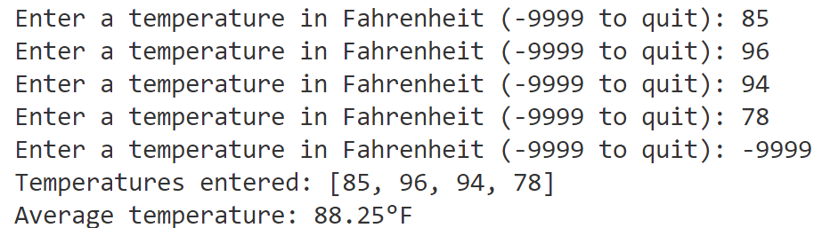

## While Loops in Python

### Overview

As part of this activity, you'll learn:
- when to use a FOR loop and when to use a WHILE loop
- how to write and use a WHILE loop

### Resources

Review these resources if you need a refresher on how `while` loops work and different ways to set up a `while` loop.

- Watch this brief YouTube video about [Python while loops](https://youtu.be/rRTjPnVooxE?feature=shared)

- Read this [handout](https://github.com/manfredspitze/while-loops-starter/blob/main/while-loops-quick-guide.md) about Python WHILE loops

### Practice

- Use comments to label each activity in your `main.py` file

#### Number Guess Game with WHILE Loop

- Watch the video and write the code discussed in the video
- [YouTube: Number Guess Game with WHILE Loop](https://www.youtube.com/watch?v=Jk3az4ZXEKU)

#### Managing a List with a WHILE Loop

Summary: You'll use a WHILE loop to keep prompting the user to enter a temperature in degrees Fahrenheit until the user enters a temperature of -9999.

Entering a temperature of -9999 tells Python the user wants to exit (quit) the loop.

Unless the user enters a temperature of -9999, Python will **append** each temperature to a list named `temperatures`.

After the user quits the loop, use an `if-else` statement to:

- check to see `if` the **length** of the list of temperatures is greater than zero (0)
  - If the list length IS greater than zero, display the list of collected temperatures 
  - Next, use the list, the `len()` and the `sum()` functions to calculate and display the average temperature
- The `else` clause should display the message *No temperatures were entered* if the temperatures list is empty

#### Sample Output

